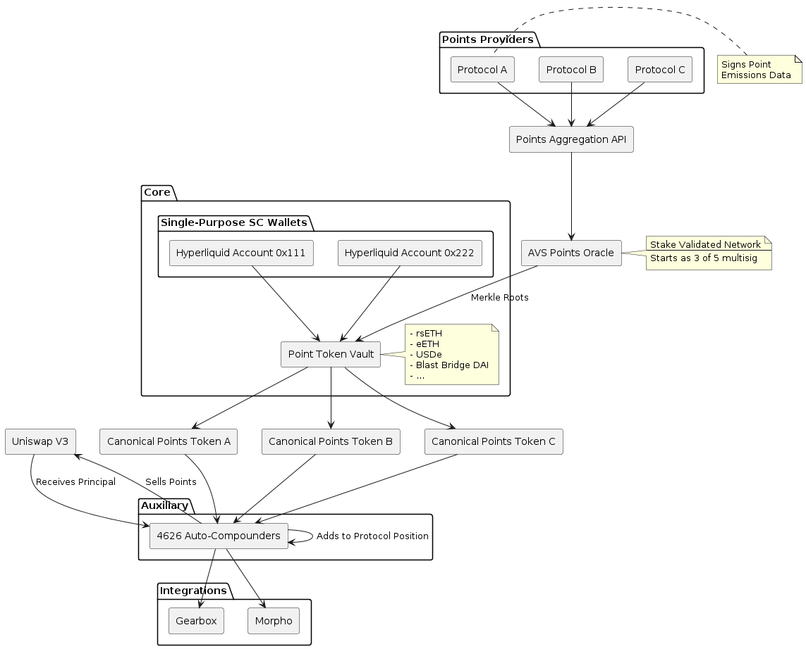

# Rumpel Wallet

Rumpel Wallet is a system built atop [Safe](https://docs.gnosis.io/safe/latest/) that allows users to tokenize points earned from personal, custom positions. Each wallet is a standard Safe, which users can manage via the normal Safe app, enhanced with a custom [Safe Module](https://docs.safe.global/advanced/smart-account-modules) and [Safe Guard](https://docs.safe.global/advanced/smart-account-guards).

This is an extension of the Rumpel Point Tokenization protocol, enabling a wider range of points, earned from a wider range of point-earning actions, to be tokenized. Familiarity with the [Point Tokenization Vault](https://github.com/sense-finance/point-tokenization-vault) is recommended before proceeding. The diagram below illustrates how this component fits within the larger system:



Tl;dr
- Users create and manage unique positions using their Rumpel wallets
- Points accrue as pTokens via the Point Tokenization Vault
- Users can sell their pTokens at any time
- After redemption, the protocol converts points to reward tokens, claims them for users, and transfers them to the vault
- All pToken holders can redeem their pTokens for rewards using the vault

The redemption process will be the same as it has been for the Point Tokenization Vault, just with a new source of reward tokens.


## Components

### Rumpel Module

Enables admin actions on a user's behalf, specifically:
- Claiming reward tokens after point conversion
- Transferring reward tokens to the Point Tokenization Vault for pToken redemption
Includes a permanent, irrevocable blocklist for restricted actions (e.g., transferring user's USDC).

### Rumpel Guard

Restricts wallet actions to admin-allowed <address>.<functionSig> calls. Includes a permanent, irrevocable allowlist for unrestricted user actions (e.g., transferring USDC).

### RumpelWalletFactory

Creates and initializes new Safe wallets with the Rumpel Guard and Rumpel Module.

## Local development

This project uses [Foundry](https://github.com/gakonst/foundry) as the development framework.

### Dependencies

```
forge install
```

### Compilation

```
forge build
```

### Testing

Rename `.env.sample` to `.env` and set the correct environment variables. Then:

```
forge test
```
